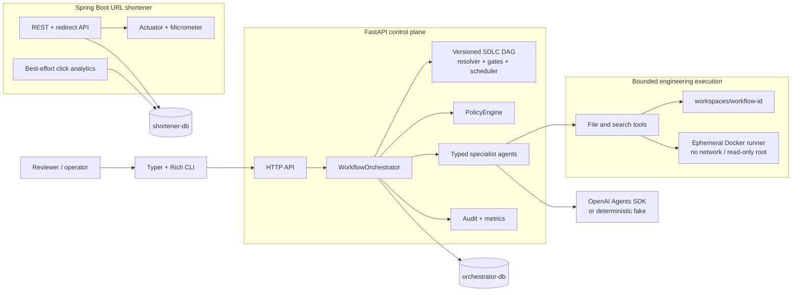

# Schwab Agentic Engineering

A local, evidence-driven prototype of a deterministic software-delivery orchestrator, demonstrated with a Java/Spring Boot URL shortener. The repository combines explicit workflow control, typed specialist agents, human approval checkpoints, immutable artifacts, bounded engineering tools, and two PostgreSQL-backed services.

This project is designed for engineering review. It is not presented as a production-ready autonomous development platform.

## What this demonstrates

The repository demonstrates how agentic software delivery can keep control-plane decisions outside the model:

- a configurable, validated SDLC DAG with deterministic dependency resolution;
- persisted workflow, stage, attempt, decision, approval, audit, and artifact state;
- fan-out execution with bounded `asyncio` concurrency and explicit fan-in joins;
- eight specialist agents with versioned instructions, typed Pydantic outputs, tool allowlists, turn limits, and timeouts;
- exact-version architecture, high-impact, assumption, and release approvals;
- entry and exit gates that return `PASS`, `FAIL`, or `WAIT`;
- classified retry, deterministic fallback, safe-stop, and semantic compensation;
- immutable artifact versions with typed lineage and selective re-planning;
- workspace-contained file tools and an isolated command runner;
- deterministic policy decisions, append-only audit records, and reliability metrics; and
- repeatable greenfield, brownfield, ambiguous-requirement, re-planning, recovery, and synchronization tests.

The OpenAI Agents SDK adapter is implemented. Automated tests use the deterministic fake provider by default, and no live OpenAI engineering run is claimed in the recorded evidence.

## Why URL shortener is the vehicle

A URL shortener is small enough to understand quickly while still exposing real engineering concerns across the delivery lifecycle:

| Concern | URL-shortener behavior |
|---|---|
| API design | Create, inspect, redirect, disable, and analytics endpoints |
| Persistence | Links, idempotency records, and click events with Flyway migrations |
| Correctness | Base62 code generation, unique constraints, collision retries, and idempotency |
| Reliability | Expiry, disabled links, rate limiting, asynchronous analytics, and health checks |
| Security | HTTP/HTTPS validation, credential rejection, reserved aliases, bounded metadata collection |
| Evolution | Brownfield addition of aliases and expiration without discarding existing behavior |
| Observability | Actuator, Micrometer/Prometheus metrics, trace IDs, and click aggregation |

The implemented redirect contract is intentionally precise: active links return `302`, missing codes return `404`, and expired or disabled links return `410`.

## Architecture diagram



The services have separate databases, migration histories, build configurations, and ownership boundaries. Docker Compose starts `orchestrator-db`, `shortener-db`, `url-shortener`, and `orchestrator` with health-gated dependencies and persistent named volumes.

## Agent vs orchestrator authority model

Agents propose typed engineering results. They do not own workflow truth.

| Actor | Authority |
|---|---|
| Specialist agent | Receives an immutable context, calls only its allowed tools, and returns a schema-validated result |
| `WorkflowOrchestrator` | Sole application authority for `WorkflowRun.status` and `StageRun.status`; applies legal transitions and writes the matching audit event atomically |
| Dependency resolver and gates | Compute readiness or return `PASS`/`FAIL`/`WAIT`; they do not bypass orchestrator transitions |
| Human reviewer | Approves or rejects an exact artifact ID and version, or answers a versioned clarification |
| Policy engine | Returns versioned `ALLOW`, `DENY`, or `REQUIRE_APPROVAL` decisions from trusted typed facts |
| Persistence layer | Enforces immutable artifacts, append-only audit history, unique claims, versions, and transaction boundaries |

The eight specialists are Requirement, Planning, Architecture, Implementation, Test, Security, Documentation, and Release Readiness. Provider code receives no SQLAlchemy session, status callback, approval capability, or database mutation tool.

## Technology stack

| Area | Technology |
|---|---|
| URL service | Java 21, Spring Boot 3.5.16, Spring Web, Spring Data JPA, Flyway, Actuator, Micrometer, springdoc-openapi |
| Orchestrator | Python 3.12.13, FastAPI 0.142.2, SQLAlchemy 2.1.3, Alembic 1.20.0, Pydantic 2.13.5 |
| Agent runtime | `openai-agents` 0.23.1 plus a deterministic fake provider |
| CLI | Typer 0.27.2, Rich 15.0.0, HTTPX |
| Data | Two PostgreSQL 17.7 services with independent named volumes |
| Build | Maven 3.9.16 through the checked-in wrapper; uv 0.11.8 and a checked-in lockfile |
| Testing | JUnit, Testcontainers, pytest, pytest-asyncio, disposable PostgreSQL fixtures |
| Packaging | Multi-stage, non-root Docker images and Docker Compose |

Repository layout:

```text
apps/url-shortener/   Spring Boot product service
apps/orchestrator/    FastAPI control plane, agent runtime, governance, and CLI
scenarios/            Greenfield, brownfield, and ambiguous fixtures
workspaces/           Per-workflow engineering workspaces
docs/                 Specification, ADRs, testing records, and evidence manifests
scripts/              Health, smoke, database, runner, and structure checks
```

## Quick start

Prerequisites are Docker with Compose v2, GNU Make, a POSIX shell, curl, and network access for the first image and dependency downloads.

From the repository root:

```sh
docker compose up --build
```

The default loopback endpoints are:

- URL shortener: `http://127.0.0.1:8080`
- URL OpenAPI: `http://127.0.0.1:8080/v3/api-docs`
- URL readiness: `http://127.0.0.1:8080/actuator/health/readiness`
- Orchestrator: `http://127.0.0.1:8000`
- Orchestrator OpenAPI: `http://127.0.0.1:8000/openapi.json`
- Orchestrator metrics: `http://127.0.0.1:8000/metrics`

For detached startup and verification:

```sh
# Optional local overrides; replace the development passwords outside local review.
cp .env.example .env

make up
make health
make demo
make down
```

`make demo` is a packaged-service smoke test. It checks both databases, both application health endpoints, URL creation, metadata, redirect, analytics, both OpenAPI documents, and orchestrator metrics. It is not a live agent-generated engineering workflow. `make down` preserves named volumes.

## Terminal demo

Install the locked Python environment and inspect the Rich CLI:

```sh
cd apps/orchestrator
uv sync --locked
uv run --locked agentic --help
ORCHESTRATOR_BASE_URL=http://127.0.0.1:8000 \
  uv run --locked agentic metrics
```

The CLI contains commands for workflow status/watch/graph, approvals, artifacts, lineage, clarifications, requirement updates, audit history, metrics, and the three named demos. It communicates only through FastAPI and never imports the persistence layer.

The current server route set is partial. Health, metrics, approval decision submission, clarification submission, requirement update, and safe-stop resume are registered in FastAPI. Workflow create/status/graph, artifact/lineage/audit, and several list endpoints used by the broader CLI are contract-tested with mock HTTP transports but are not yet registered in `app.main`. Consequently, `agentic demo greenfield`, `brownfield`, and `ambiguous` do not yet provide a complete live CLI walkthrough against the Compose server. The scenario tests below are the verified demonstration path.

## Greenfield scenario

Input:

> Build URL shortener with core APIs, analytics and reliability.

The fixture begins with a minimal Java 21 Spring Boot application. `GreenfieldScenarioIT` persists a `GREENFIELD` workflow and executes the configured 16-stage DAG with deterministic specialist outputs. It verifies exact-version architecture and release approval pauses, both parallel stage groups, synchronization joins, immutable lifecycle artifacts, and final workflow completion.

```sh
UV=uv scripts/test-postgres.sh \
  tests/test_zz_required_scenarios.py::GreenfieldScenarioIT -q
```

This proves deterministic orchestration behavior. The fake implementation artifact is a structured report, not evidence that a live model authored the completed URL-shortener code. The actual product is verified separately by the Java suite.

See [Greenfield scenario details](docs/scenarios/GREENFIELD.md).

## Brownfield scenario

Input:

> Add custom aliases and expiration.

The fixture materializes an existing Spring Boot service into its workflow workspace. `SourceImpactAnalyzer` inspects source through the bounded workspace API and identifies responsibilities from annotations, JPA declarations, redirect calls, Flyway SQL, tests, and OpenAPI metadata. The expected controller, service, domain/entity, repository, redirect, migration, test, and documentation impacts are derived from inspected files rather than a hard-coded class-name list.

```sh
UV=uv scripts/test-postgres.sh \
  tests/test_zz_required_scenarios.py::BrownfieldScenarioIT -q
```

A rename test confirms that an annotated service remains discoverable under a different class and path. The scenario records deterministic planning and implementation-report artifacts; the full Spring Boot suite separately verifies the working alias and expiry behavior.

See [Brownfield scenario details](docs/scenarios/BROWNFIELD.md).

## Ambiguous scenario

Input:

> Make links safer.

The deterministic RequirementAgent identifies blocking ambiguity around malicious destinations, HTTPS enforcement, automatic expiration, authentication, private-network URLs, and anti-enumeration. The workflow moves to `WAITING_FOR_CLARIFICATION`; architecture and implementation remain blocked and implementation receives no start time.

```sh
UV=uv scripts/test-postgres.sh \
  tests/test_zz_required_scenarios.py::AmbiguousScenarioIT -q
```

Submitting complete answers creates immutable clarification and requirement versions, stales affected prior work, and reruns requirement analysis in a new generation. No safety interpretation is selected silently.

See [Ambiguous scenario details](docs/scenarios/AMBIGUOUS.md).

## Dynamic re-planning

`ReplanningScenarioIT` starts with the rule “Expired links return 404,” then changes it to “Expired links return 410 Gone.” The selective-impact algorithm:

1. creates Requirement V2 and supersedes V1;
2. traverses downstream lineage;
3. marks affected architecture, implementation, test, and documentation artifacts `STALE`;
4. invalidates the approval for the stale architecture version;
5. preserves an unrelated analytics artifact as active; and
6. returns the workflow to affected planning/design work instead of restarting intake.

```sh
UV=uv scripts/test-postgres.sh \
  tests/test_replanning.py::ReplanningScenarioIT -q
```

The update endpoint prepares the new generation. Scheduler cycles perform subsequent work, and renewed architecture approval is still required. The recorded test does not claim that revised release validation has already happened.

## Failure handling

The scheduler classifies failures before deciding what may happen next:

- retryable: OpenAI timeout, temporary provider failure, and temporary workspace-tool failure;
- non-retryable: policy violation, failed assertion, invalid requirement, security violation, or forbidden tool request;
- retry bound: two total attempts by default;
- fallback: an explicitly configured deterministic provider after real-provider retry exhaustion;
- safe-stop: retry exhaustion without fallback, invalid state, security violation, forbidden tool action, or corrupted lineage; and
- compensation: a failed mandatory downstream validation rolls back the candidate artifact while preserving a prior approved artifact when one exists.

`SAFE_STOPPED` stores the failure reason, last successful stage, and recommended human action, and prevents descendants from running. Semantic compensation records `ROLLBACK_STARTED` and `ROLLBACK_COMPLETED`; it does not claim distributed transaction, database migration, or deployment rollback.

The recorded `FailureRecoveryScenarioIT` and compensation integration tests use injected deterministic failures. They do not simulate a real OpenAI outage.

## Governance/security

The prototype applies several independent controls:

- every workflow receives a canonical `workspaces/<workflow-UUID>/` boundary;
- traversal, outside absolute paths, credential files, special files, and Docker socket paths are rejected;
- writes use descriptor-relative checks, reject links, run a lightweight secret scan, and replace files atomically;
- agent commands are limited to exact Maven test/package and pytest profiles;
- candidate commands run in a fresh Docker container with no network, no host mounts, no Docker socket, a read-only root filesystem, dropped capabilities, bounded resources, and UID/GID 10001;
- schema changes and breaking API changes require exact current approvals;
- mandatory test or security failures deny release; and
- policy denials are persisted with a matching audit event in one transaction.

Human decisions use a local bearer token plus `X-Reviewer-Id`. This establishes a prototype trust boundary, not production identity or authorization. The secret scanner is deliberately lightweight and is not a substitute for a maintained scanner or incident-response process.

See [engineering tool security](docs/SECURITY.md) and the [policy evidence](docs/evidence/phase-20-policy/manifest.json).

## Metrics

FastAPI exposes Prometheus 0.0.4 text at `GET /metrics`, reconstructed from committed PostgreSQL records so process restarts do not reset counters. Exported series include:

- workflow started, completed, failed, and safe-stopped totals;
- stage execution, retry, and rollback totals;
- workflow and stage duration histograms;
- policy violation and approval-waiting totals;
- current pending approvals;
- success, retry, and rollback frequencies;
- MTTR and unresolved recovery incidents; and
- end-to-end workflow latency, including human waits.

The reporting cohort is currently all retained records, and zero-denominator ratios render as Prometheus `NaN`. Metrics intentionally avoid workflow, artifact, actor, trace, and stage labels; audit records carry per-workflow detail.

The URL service separately exposes Actuator/Micrometer health, readiness, metrics, and Prometheus endpoints. See [metric definitions](docs/METRICS.md).

## Testing

Primary commands:

```sh
make test             # Java verify plus non-integration Python tests
make test-db          # disposable PostgreSQL integration suite
make test-runner      # build and security-test the isolated engineering runner
make compose-config   # validate Docker Compose
make demo             # build, start, health-check, and HTTP-smoke the stack
```

Recorded scenario-phase runs on 2026-10-05 reported:

| Suite | Recorded result |
|---|---|
| URL shortener Maven verification | 37 passed, 0 failed, 0 skipped |
| Orchestrator offline suite | 252 passed, 8 explicit opt-in skips, 54 PostgreSQL tests deselected |
| Orchestrator PostgreSQL suite | 54 passed |
| Greenfield seed | 1 passed |
| Brownfield seed | 2 passed |
| Docker Compose smoke | Passed; all four services healthy and persisted link data survived down/up |

These figures come from separate recorded runs and should not be added together as a unique-test total. Live-provider tests are opt-in and were not run. See [testing records](docs/TESTING.md), [scenario evidence](docs/evidence/phases-23-25-scenarios/manifest.json), [Compose evidence](docs/evidence/phase-26-compose/manifest.json), and the [requirement traceability matrix](docs/TRACEABILITY.md).

## ADR links

- [ADR-001: Service boundaries](docs/decisions/ADR-001-service-boundaries.md)
- [ADR-002: Deterministic orchestration](docs/decisions/ADR-002-deterministic-orchestration.md)
- [ADR-003: OpenAI agent runtime](docs/decisions/ADR-003-openai-agent-runtime.md)
- [ADR-005: Analytics design](docs/decisions/ADR-005-analytics-design.md)

The detailed dependency-ordered roadmap is in [IMPLEMENTATION_PLAN.md](IMPLEMENTATION_PLAN.md), and the normative engineering requirements are in [docs/IMPLEMENTATION_SPEC.md](docs/IMPLEMENTATION_SPEC.md).

## Known limitations

- The recorded automated workflows use the deterministic fake provider; a live OpenAI engineering workflow has not been verified.
- FastAPI does not yet register the complete workflow read/create, graph, artifact, lineage, audit, and list API surface expected by the CLI.
- The CLI command surface is broadly implemented and mock-contract tested, but only commands backed by registered server routes work against the current Compose service.
- Scenario tests validate persisted orchestration with structured fake outputs; they do not prove model-authored candidate code or a live end-to-end CLI workflow.
- Scheduler progress is driven by explicit cycles rather than a production worker/queue daemon. Expired-lease and uncertain external-effect reconciliation remain incomplete.
- Compensation is semantic artifact rollback. It does not reverse database migrations, deployments, or irreversible external side effects.
- The local reviewer bearer token is not an identity provider, RBAC system, or production authorization model.
- The engineering secret scanner is heuristic, and local Docker isolation does not defend against a hostile Docker or host administrator.
- Compose uses local development credentials, loopback ports, and no TLS. Application database users are isolated by separate containers but are not a production least-privilege design.
- URL creation rate limiting is in-memory and per instance. Click analytics are best-effort, can lag or drop under failure, and have no retention job.
- Orchestrator metrics scan the all-time retained cohort; long-retention deployments need recording rules or bounded materialization.
- CI implementation and a final live-provider reviewer walkthrough remain outside the verified scope recorded here.

## Production evolution

A production implementation would need deliberate work in several areas:

1. Complete and version the missing FastAPI workflow, graph, artifact, lineage, audit, and pagination routes, then run the CLI scenarios against that real boundary.
2. Replace the local reviewer token with enterprise identity, RBAC, separation of duties, TLS, credential rotation, and protected audit access.
3. Move scheduling to durable workers with leases, heartbeats, fencing, restart reconciliation, and idempotent handling of uncertain external effects.
4. Provision least-privilege database roles, managed secrets, encrypted backups, tested restore procedures, retention policies, and migration controls.
5. Move artifacts and candidates to durable content-addressed storage with signed provenance and controlled promotion between environments.
6. Strengthen untrusted-code isolation with remote builders or VM-grade sandboxes, maintained base images, vulnerability scanning, and centrally enforced egress policy.
7. Replace per-instance rate limiting and best-effort analytics with shared limits, a durable event pipeline, explicit delivery semantics, and retention management.
8. Add bounded metric windows, recording rules, dashboards, alerting, service-level objectives, and capacity tests.
9. Add GitHub Actions with pinned actions, dependency and secret scanning, Compose smoke, scenario suites, and protected opt-in live-provider evaluation.
10. Run controlled OpenAI provider evaluations for quality, safety, latency, token cost, tool behavior, model/version drift, and fallback effectiveness before enabling autonomous changes.
