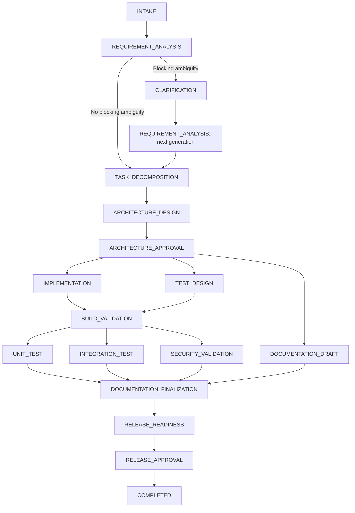

# Charles Schwab Agentic-Proficient Software Engineer

## Implementation Specification

**Version:** 1.0  
**Intended repository path:** `docs/IMPLEMENTATION_SPEC.md`  
**Project:** `schwab-agentic-engineering`  
**Purpose:** Define the complete implementation, verification, and reviewer experience for a URL-shortening product and an agentic software-engineering platform.

This document consolidates the finalized architecture and implementation decisions from **Requirement Analysis and Orchestration Design**. It is an implementation contract, not a claim that the software is already built or production-certified. The retrieved conversation contains truncated messages, and the original assignment PDF was not available during consolidation. Detailed contracts and acceptance criteria below make the available design executable; reconcile assignment-specific wording against `docs/schwab-assignment.pdf` before submission. The full scope is retained, rather than the earlier time-boxed reduction.

## Contents

1. [Objective and completion standard](#1-objective-and-completion-standard)
2. [Architecture and technology decisions](#2-architecture-and-technology-decisions)
3. [Repository layout](#3-repository-layout)
4. [Spring Boot URL shortener](#4-spring-boot-url-shortener)
5. [Orchestrator persistence and state](#5-orchestrator-persistence-and-state)
6. [Explicit SDLC DAG](#6-explicit-sdlc-dag)
7. [Gates and human approvals](#7-gates-and-human-approvals)
8. [Specialist agents and engineering tools](#8-specialist-agents-and-engineering-tools)
9. [Parallel execution and synchronization](#9-parallel-execution-and-synchronization)
10. [Retries, fallback, rollback, and safe-stop](#10-retries-fallback-rollback-and-safe-stop)
11. [Artifact lineage and dynamic replanning](#11-artifact-lineage-and-dynamic-replanning)
12. [Policy guardrails](#12-policy-guardrails)
13. [APIs and terminal experience](#13-apis-and-terminal-experience)
14. [Three required scenarios](#14-three-required-scenarios)
15. [Audit and reliability metrics](#15-audit-and-reliability-metrics)
16. [Testing and acceptance evidence](#16-testing-and-acceptance-evidence)
17. [Docker Compose and local operation](#17-docker-compose-and-local-operation)
18. [Codex workflow and implementation phases](#18-codex-workflow-and-implementation-phases)
19. [CI and documentation](#19-ci-and-documentation)
20. [Final review checklist](#20-final-review-checklist)

## 1. Objective and completion standard

Deliver one GitHub monorepo with two independently structured backend applications and a polished terminal client:

- A real Spring Boot URL shortener with creation, redirects, aliases, expiration, idempotency, analytics, and reliability controls.
- A FastAPI platform that deterministically coordinates an explicit software-development lifecycle DAG.
- OpenAI Agents SDK specialists that perform bounded engineering work and return validated structured outputs.
- PostgreSQL persistence, reproducible Docker Compose startup, automated tests, GitHub Actions CI, and clear reviewer documentation.

The platform must visibly demonstrate dependency resolution, entry and exit gates, human approvals, concurrent stages and joins, bounded recovery, immutable artifacts, decision lineage, selective replanning, policy enforcement, and measurable outcomes.

**Definition of done:** all required capabilities have implementation, tests, and reproducible demonstration evidence. No required feature is represented only by a diagram, canned prose, TODO, or an unexecuted claim. Automated tests may use deterministic agent doubles; a separately identified live run must demonstrate the actual OpenAI Agents SDK integration.

## 2. Architecture and technology decisions

### 2.1 Service boundaries

```text
Reviewer / Engineer
        |
        v
Typer + Rich CLI -----------------------> FastAPI OpenAPI UI
        |
        v
FastAPI deterministic orchestrator
        |                  |                     |
        v                  v                     v
Orchestrator DB     OpenAI Agents SDK     Isolated workflow workspaces
                   specialist agents     + restricted engineering tools
                                                 |
                                                 v
                                      Candidate code and test evidence

Spring Boot URL Shortener <------------- API / demonstration requests
        |
        v
URL service DB

Docker Compose runs the local system.
One PostgreSQL server may host two separately owned databases.
```

| Component | Owns | Boundary |
|---|---|---|
| Spring Boot | URL product behavior, product persistence, validation, analytics, health, metrics | Does not manage SDLC workflow state |
| FastAPI | Scheduling, state transitions, gates, approvals, retries, compensation, policy, artifacts, lineage, audit, metrics, replanning | Is the sole workflow authority |
| OpenAI Agents SDK | Requirement reasoning, planning, architecture, code changes, test design, security review, documentation, release assessment | Returns results and invokes authorized tools; cannot transition workflows |
| Typer/Rich | Reviewer commands, workflow views, approval and clarification interaction | Uses orchestrator APIs; cannot bypass gates or write directly to the database |
| PostgreSQL | Durable product and orchestration data | Separate credentials and migrations for each service |

**Critical authority rule:** agents propose and produce; validators check; policy authorizes; the deterministic orchestrator transitions state; humans approve actions that require approval. Agent text is never sufficient evidence that a test passed or approval was granted.

### 2.2 Technology stack

| Area | Selected technologies |
|---|---|
| URL shortener | Java 21, Spring Boot 3.x, Maven Wrapper, Spring Web, Spring Data JPA, PostgreSQL, Flyway |
| Java verification and operations | JUnit 5, Mockito, Testcontainers, Actuator, Micrometer, springdoc-openapi; Resilience4j where a concrete resilience policy needs it |
| Orchestrator | Python 3.12+, FastAPI, Pydantic, SQLAlchemy 2, Alembic, PostgreSQL, httpx |
| Agent runtime | Python OpenAI Agents SDK (`openai-agents`), behind an `AgentProvider` interface |
| Python verification and operations | pytest, pytest-asyncio, Prometheus client; Tenacity only where it does not duplicate orchestrator retries |
| Terminal client | Typer and Rich |
| Infrastructure | Docker, Docker Compose, GitHub Actions |

Pin compatible dependency versions and container images during bootstrap. Keep the model configurable through `OPENAI_MODEL`; record the actual model and SDK version in execution evidence.

Do not introduce Kafka, Redis, Kubernetes, Temporal, LangGraph, React, Angular, MongoDB, or Elasticsearch into the required implementation. The CLI is the primary UI; both services also expose OpenAPI documentation. Describe future scaling options in `LIMITATIONS.md` without making them prerequisites.

The OpenAI Agents SDK runs the agent loop inside the application; the application retains ownership of tools, storage, and approval decisions. See the [official Agents SDK guide](https://developers.openai.com/api/docs/guides/agents/sdk).

## 3. Repository layout

```text
schwab-agentic-engineering/
├── AGENTS.md
├── IMPLEMENTATION_PLAN.md
├── README.md
├── Makefile
├── docker-compose.yml
├── .env.example
├── .gitignore
├── apps/
│   ├── url-shortener/
│   │   ├── pom.xml
│   │   ├── mvnw
│   │   ├── .mvn/
│   │   ├── Dockerfile
│   │   └── src/
│   └── orchestrator/
│       ├── pyproject.toml
│       ├── Dockerfile
│       ├── alembic.ini
│       ├── alembic/
│       ├── config/default_sdlc.yaml
│       ├── app/
│       │   ├── api/
│       │   ├── agents/
│       │   ├── orchestration/
│       │   ├── artifacts/
│       │   ├── governance/
│       │   ├── persistence/
│       │   ├── tools/
│       │   ├── observability/
│       │   └── cli/
│       └── tests/
├── docs/
│   ├── schwab-assignment.pdf
│   ├── IMPLEMENTATION_SPEC.md
│   ├── ARCHITECTURE.md
│   ├── DEMO.md
│   ├── TESTING.md
│   ├── SECURITY.md
│   ├── LIMITATIONS.md
│   ├── TRACEABILITY.md
│   ├── decisions/
│   │   ├── ADR-001-service-boundaries.md
│   │   ├── ADR-002-deterministic-orchestration.md
│   │   ├── ADR-003-openai-agent-runtime.md
│   │   ├── ADR-004-artifact-lineage.md
│   │   └── ADR-005-analytics-design.md
│   └── scenarios/
│       ├── GREENFIELD.md
│       ├── BROWNFIELD.md
│       └── AMBIGUOUS.md
├── scenarios/
│   ├── greenfield/seed/
│   ├── brownfield/seed/
│   └── ambiguous/seed/
├── workspaces/.gitkeep
├── scripts/smoke-test.sh
└── .github/workflows/ci.yml
```

Java packages: `api`, `application`, `domain`, `persistence`, `analytics`, `config`, and `observability`. Keep generated workflow workspaces, secrets, caches, and transient logs out of Git. Include the assignment PDF in a public repository only if sharing is permitted.

## 4. Spring Boot URL shortener

### 4.1 HTTP contract

| Endpoint | Required behavior |
|---|---|
| `POST /api/v1/links` | Create a link; accept optional alias, expiry, and `Idempotency-Key`; return `201` with metadata and short URL |
| `GET /{shortCode}` | `302` and `Location` for an active, unexpired link; `410` for expired or disabled; `404` for missing |
| `GET /api/v1/links/{shortCode}` | Return link metadata without incrementing analytics; `404` for missing |
| `GET /api/v1/links/{shortCode}/analytics` | Return `shortCode`, `totalClicks`, and `clicksByDay`; `404` for missing |
| `DELETE /api/v1/links/{shortCode}` | Soft-disable an existing link; `204`, including repeated disable; `404` for missing |

Create request:

```json
{
  "url": "https://example.com/article",
  "customAlias": "my-link",
  "expiresAt": "2026-12-31T23:59:59Z"
}
```

Metadata contains `id`, `shortCode`, `shortUrl`, `url`, `status`, `createdAt`, and nullable `expiresAt`. Expiration is evaluated using UTC and an injectable clock. Return structured errors containing a stable error code, human-readable message, trace ID, and validation details where appropriate. Never expose stack traces or secrets.

### 4.2 Domain and reliability rules

- **Codes:** generate seven-character Base62 codes with a secure random source. Enforce a database unique constraint on `short_code`. Retry generated-code collisions at most five total attempts; return a structured service error after exhaustion. Inject `ShortCodeGenerator` so tests can force collisions. Each retry must use a transaction/savepoint strategy that recovers correctly from a uniqueness violation.
- **Aliases:** allow 3–32 characters matching `[A-Za-z0-9_-]+`. Preserve case and use case-sensitive uniqueness consistently. Reject reserved names case-insensitively: `api`, `actuator`, `swagger-ui`, `v3`, and `health`. Duplicate alias returns `409`; invalid or reserved alias returns `400`.
- **Expiration:** a provided timestamp must be in the future at creation. At or after `expiresAt`, redirect returns `410`. Expiry does not depend on a background cleanup job.
- **Idempotency:** persist a request fingerprint and original response/link reference, scoped to the caller when identity exists. The same key and equivalent request return the original result; a different request returns `409`. Concurrent identical requests must create one link. Enforce uniqueness and transactional correctness in PostgreSQL. Document retention; keys must not silently expire during the demonstrated retry window.
- **URL validation:** accept only absolute HTTP/HTTPS URLs with a host. Reject malformed URLs, embedded credentials, control characters, and unsupported schemes. Do not fetch destinations while creating or redirecting links. Further restrictions such as HTTPS-only or private-address blocking are scenario-driven policy decisions, not silently assumed requirements.
- **Rate limiting:** use a bounded, in-memory limiter for link creation. Configure capacity/window and return `429` with `Retry-After`. Document that it is per instance and resets on restart. Do not add Redis.
- **Concurrency:** use database constraints for uniqueness and optimistic locking where mutable link state needs it. Never rely only on a read-before-insert check.

### 4.3 Persistence and analytics

Use Flyway migrations for `links`, `idempotency_records`, and `click_events`. Index short-code lookups and analytics queries by link and timestamp.

On a successful redirect, record link ID, UTC timestamp, optional sanitized referrer, coarse user-agent category, and trace ID. Minimize retained identifying information; do not store raw client IP addresses by default. Aggregate clicks by UTC calendar day.

**Analytics failure must not prevent a valid redirect.** Isolate the analytics write from the redirect lookup transaction, bound its duration, catch failures, and increment a failure metric. Document best-effort delivery and possible lost events; do not claim exactly-once counting. Count successful redirects only. Test a forced analytics persistence failure and confirm that `302` still succeeds.

Expose health/readiness, request and redirect metrics, analytics failures, structured logs, and OpenAPI documentation. Management endpoints that reveal sensitive internals must not be exposed publicly.

## 5. Orchestrator persistence and state

### 5.1 Durable model

Use UUID identifiers, UTC timestamps, foreign keys, explicit schema migrations, and concurrency/version fields where needed.

| Entity | Required information |
|---|---|
| `workflow_runs` | Scenario, status, requirement version, graph version, workspace reference, provider mode, timestamps, last successful stage, stop reason |
| `stage_runs` | Workflow, stage name, generation, attempt, status, input artifact IDs/hashes, executor, lease/claim, timestamps, result/error |
| `artifacts` | Logical name/type, immutable version, content or durable URI, content hash, schema version, producer stage/attempt |
| `artifact_lineage` | Parent/child artifact versions, relationship, affected requirement/component identifiers |
| `decisions` | Decision, rationale, alternatives, actor, related artifact versions, requirement IDs |
| `approvals` | Type, reviewer, exact artifact version/hash, status, reason, decision time |
| `audit_events` | Append-only execution and governance history |
| `policy_events` | Rule/version, allow/deny/wait decision, actor/tool, reason, artifact references |

Persist clarification questions and answers, retry schedules, graph revisions, and recovery information either as dedicated tables or typed, queryable records. Preserve every attempt; never overwrite the previous attempt's evidence. Artifact contents are immutable; lifecycle changes such as `STALE`, `SUPERSEDED`, and `ROLLED_BACK` belong in audited metadata/events.

### 5.2 States and transition authority

```text
ScenarioType:
  GREENFIELD | BROWNFIELD | AMBIGUOUS

WorkflowStatus:
  CREATED | RUNNING | WAITING_FOR_CLARIFICATION | WAITING_FOR_APPROVAL
  REPLANNING | SAFE_STOPPED | COMPLETED | FAILED | CANCELLED

StageStatus:
  PENDING | BLOCKED | READY | RUNNING | WAITING_APPROVAL | SUCCEEDED
  FAILED | RETRY_PENDING | FALLBACK_RUNNING | ROLLED_BACK | STALE
  SKIPPED | SAFE_STOPPED | CANCELLED
```

Only `WorkflowOrchestrator` may transition workflow or stage state. Define and test legal transition tables. Examples include `BLOCKED → READY`, `READY → RUNNING`, `RUNNING → SUCCEEDED`, `RUNNING → FAILED`, `FAILED → RETRY_PENDING`, and `SUCCEEDED → STALE`. A retry/replan creates a new attempt or generation while retaining the old record.

State changes and their audit events commit atomically. Reject stale/concurrent updates using version checks or row locking. Reject duplicate active stage claims. A restart must recover persisted state without silently rerunning successful work. Reconcile interrupted leases and uncertain tool effects before retrying.

`COMPLETED` requires all required current-generation gates and release approval. `SAFE_STOPPED` requires explicit human recovery after the cause is addressed. `FAILED` represents an unsuccessful closed run; `CANCELLED` records requested termination. Define workflow summary status consistently when independent branches have different states, and expose each stage separately.

## 6. Explicit SDLC DAG

Store the graph in `apps/orchestrator/config/default_sdlc.yaml`. Do not bury it in one procedural function or allow a model to invent state transitions.



The diagram depicts separate analysis generations. Clarification and replanning must not introduce a cycle into one executable DAG: create a versioned graph/generation with new stage instances, preserving prior history.

Each stage definition includes:

```yaml
name: BUILD_VALIDATION
dependencies: [IMPLEMENTATION, TEST_DESIGN]
executor: build_executor
entry_gate: candidate_and_test_plan_current
exit_gate: build_passed
retry_policy:
  max_attempts: 2
  retryable_errors: [TRANSIENT_TOOL_ERROR]
fallback: null
approval_policy: none
```

Also define bounded timeouts and input/output contracts. Resolve executor/gate names through registries; configuration must not execute arbitrary code. Reject duplicate names, unknown dependencies/executors/gates, invalid retry policies, and graph cycles before starting a run. Persist a graph version/hash with the workflow.

## 7. Gates and human approvals

### 7.1 Gates

Every gate returns `PASS`, `FAIL`, or `WAIT` with reasons and evidence references.

| Boundary | Required checks |
|---|---|
| Requirement exit | Normalized requirement, acceptance criteria, assumptions, ambiguity status, risks |
| Planning entry | Current analyzed requirement; no unresolved blocking ambiguity |
| Architecture entry | Current normalized requirement, acceptance criteria, and valid task plan |
| Architecture exit | Components, interfaces, API/data changes, security considerations, failure behavior, tradeoffs, testing implications |
| Implementation entry | Exact current architecture version approved; approved assumptions where required; tool policy permits execution |
| Implementation exit | Candidate/change manifest and actual tool evidence; required files produced; output schema valid |
| Build entry | Current implementation candidate and test design from compatible input versions |
| Validation exit | Actual command/scanner results satisfy checks; no fabricated or stale evidence |
| Release readiness entry | Build, unit tests, integration tests, security validation, and documentation pass; no blocking policy issue |
| Completion | Release approval references the exact release candidate and evidence manifest |

`WAIT` blocks execution until required information/approval exists. `FAIL` invokes the configured failure policy. Exit-gate failure cannot be converted into success by an agent's explanation.

### 7.2 Approval contract

Approval types: `ARCHITECTURE`, `HIGH_IMPACT_CHANGE`, `ASSUMPTION`, and `RELEASE`. Statuses: `PENDING`, `APPROVED`, `REJECTED`, and `INVALIDATED`.

Each approval references workflow, artifact ID, exact version/hash, reviewer identity, reason, and timestamp. Approval for version 1 never authorizes version 2. Changed or stale artifacts invalidate affected approvals. API retries must not create duplicate decisions.

Pause before implementation for architecture approval and before completion for release approval. Route significant schema/API/security changes and material assumptions through explicit approval policies. Rejection keeps dependent work blocked and records the reason; revision creates a new artifact and approval request.

Approval endpoints must authenticate the human reviewer or use an explicitly documented local reviewer credential. Agent tool credentials must not have approval privileges. The CLI displays the artifact, diff, risks, and affected stages before submitting a decision.

## 8. Specialist agents and engineering tools

### 8.1 Agent contracts

Use the real OpenAI Agents SDK as the primary runtime through `AgentProvider`. Provide a deterministic fake provider for automated tests. Provider mode must be visible in workflow status and evidence.

| Agent | Structured output and responsibility |
|---|---|
| `RequirementAgent` | `normalized_requirement`, `acceptance_criteria`, `ambiguities`, `clarifying_questions`, `assumptions`, `blocking_ambiguity`, `risks` |
| `PlanningAgent` | Tasks with IDs and dependencies, parallelizable groups, impacted components, risks |
| `ArchitectureAgent` | Components, API changes, data changes, security considerations, failure modes, tradeoffs, test implications |
| `ImplementationAgent` | Created/changed files, candidate reference, change summary, tests requested, risks; command evidence attached by tools |
| `TestAgent` | Test plan, acceptance-criterion mapping, generated tests, evidence references, uncovered risks |
| `SecurityAgent` | Findings with severity, rule/evidence, affected files, remediation, blocking assessment |
| `DocumentationAgent` | Documentation artifacts, API changes, run/test instructions, limitations |
| `ReleaseReadinessAgent` | Candidate/evidence references, readiness assessment, unresolved risks, release recommendation |

Each agent has explicit instructions, a Pydantic output schema, allowed tools, bounded turns/time, versioned input context, and guardrails. Model recommendations never replace deterministic security checks, test execution, or human approvals. Persist provider/model, prompt/instruction version, attempt, and trace identifiers without logging secrets.

### 8.2 Tools and isolated workspaces

Provide `list_files`, `read_file`, `search_code`, `write_file`, `apply_patch`, `run_build`, `run_tests`, and `inspect_dependencies` as restricted function tools. Copy the selected scenario seed into `workspaces/<workflow-id>/` and record its initial hash/commit.

Validate workflow ownership, canonical path containment, symlinks, operation permission, file size, and command allowlists on every call. Reject traversal, paths outside the workspace, secret files, credential directories, host mounts, Docker socket access, and arbitrary shell commands. Invoke approved commands with fixed argument arrays, bounded runtime/output, and an explicit working directory.

**A command allowlist alone is not a sandbox:** build scripts and tests execute code. Run candidate builds/tests in a restricted execution environment without host secrets, privileged access, or writable host mounts. Limit CPU, memory, process count, and network access. The trusted control plane may provision that environment; agents cannot control Docker or the host. Document and test the implemented isolation boundary.

Tool results include invocation ID, sanitized arguments, input/candidate hash, exit code, timestamps, output references, and error classification. Redact secrets from logs and artifacts.

## 9. Parallel execution and synchronization

Use bounded `asyncio` concurrency and durable PostgreSQL claims. Make concurrency configurable, with a small local default such as three workers. Record start/end timestamps so overlap can be demonstrated.

- After architecture approval, `IMPLEMENTATION`, `TEST_DESIGN`, and `DOCUMENTATION_DRAFT` may execute concurrently.
- `BUILD_VALIDATION` waits for both implementation and test design to succeed with compatible, current inputs.
- After build validation, unit tests, integration tests, and security validation run independently.
- Documentation finalization waits for all three validation stages and the documentation draft.

Parallel stages must not overwrite each other's files. Use stage-specific overlays or disjoint writable areas; assemble a candidate snapshot at the join with conflict detection. Validation stages use read-only candidate snapshots and separate temporary output directories/databases. Do not run concurrent Maven builds in one mutable `target/` directory.

Readiness requires all mandatory predecessors to have succeeded in the applicable generation, current input artifacts, passing entry gates, valid approval, and no blocking policy condition. A skipped optional stage satisfies a join only when explicitly allowed by the graph. Failed, stale, rolled-back, or partially finished parents cannot satisfy a mandatory join.

On safe-stop or replan, stop scheduling, cancel/drain active tasks, and fence late results by generation/claim token so they cannot commit success into the wrong workflow state.

## 10. Retries, fallback, rollback, and safe-stop

### 10.1 Retry policy

Default: **two total attempts**, not two retries after the initial attempt. Use bounded backoff and jitter for transient errors. Persist the attempt number and scheduled retry time. Avoid multiplied retries across SDK, HTTP client, and orchestration layers.

| Retryable | Not automatically retryable |
|---|---|
| Provider timeout or temporary unavailability | Policy rejection or forbidden tool request |
| Temporary, safely repeatable tool failure | Security violation or test assertion failure |
| Classified transient infrastructure error | Invalid requirement, corrupted lineage, invalid state |

Do not blindly repeat an operation whose effects are uncertain. Reconcile its result or stop for review. A failed assertion requires an explicit repair/replan path; repeated execution does not repair code.

### 10.2 Fallback

Use a deterministic fallback only for explicitly configured stages after permitted retries. Record `FALLBACK_RUNNING`, why it was selected, and fallback provenance. It must meet the same schema, policy, and evidence gates as the primary executor.

A deterministic fallback may produce a bounded template or known fixture where appropriate. It must not fabricate test success, security clearance, approval, or arbitrary implementation. An unsupported fallback leads to safe-stop. Label simulated/fallback demonstrations clearly.

### 10.3 Semantic rollback and compensation

Rollback means compensation of a rejected candidate, not distributed database transaction rollback.

When a candidate fails mandatory downstream validation:

1. Stop descendants and fence in-flight results.
2. Append `ROLLBACK_STARTED` with candidate and cause.
3. Mark the candidate rolled back through lifecycle metadata; retain its content and evidence.
4. Restore the previous approved candidate pointer/workspace snapshot when one exists.
5. Invalidate evidence/approvals derived from the rejected candidate.
6. Append `ROLLBACK_COMPLETED` with the restored reference, or record compensation failure and safe-stop.

If no prior approved candidate exists, preserve evidence and stop without inventing a restored release. Compensation must be idempotent. Do not imply rollback of external deployments or irreversible migrations that the system does not implement.

### 10.4 Safe-stop

Trigger on retry exhaustion without valid fallback, blocking security violation, forbidden tool action, invalid state, corrupted lineage, or unrecoverable tool/compensation failure.

Persist `SAFE_STOPPED`, failing stage, last successful stage, blocking reason, and recommended human action. No descendant may start. The terminal must clearly show the stop and recovery action. Resume requires cause resolution, input/approval revalidation, and an audited human request; it cannot simply clear the status flag.

## 11. Artifact lineage and dynamic replanning

### 11.1 Immutable provenance

Artifacts are versioned and content-addressed or content-hashed. Persist explicit relationships:

- `DERIVED_FROM`: output depends on an input artifact.
- `IMPLEMENTS`: candidate implements requirements/design.
- `VALIDATES`: evidence validates a candidate or requirement.
- `DOCUMENTS`: documentation describes an artifact.
- `SUPERSEDES`: a new version replaces an older version.

Every artifact records producing stage/attempt, exact inputs, workflow generation, schema version, and creation time. Decision records explain why an approach was chosen. Provide lineage queries and a CLI tree from requirements through release evidence.

### 11.2 Selective replanning algorithm

1. Persist the requirement update as a new immutable version and audit the human change.
2. Enter `REPLANNING`; fence obsolete work and preserve its evidence.
3. Compare stable requirement/acceptance-criterion IDs and identify affected components.
4. Traverse relevant lineage edges and DAG dependencies to compute the impacted closure.
5. Mark affected outputs/stage generations stale; invalidate approvals whose approved content or inputs changed.
6. Preserve unrelated valid artifacts with explicit reuse references.
7. Produce a revised plan and graph generation; validate it for cycles and contract consistency.
8. Obtain new approval where required, then execute only affected work and necessary synchronization/aggregate gates.

**Demonstration:** an earlier scenario requirement says expired links return `404`; a human changes it to `410 Gone`. The final product contract in this specification is `410`. Invalidate affected redirect architecture, implementation, tests, API documentation, and approvals. Preserve an independent analytics artifact. Recompute release readiness against the new candidate.

Selective reuse needs component/requirement-level lineage. If all outputs reference one monolithic requirement artifact without finer dependency information, claim only the granularity actually implemented. Never reuse old whole-candidate test results after the candidate hash changes; rerun aggregate validation as needed even when unaffected component artifacts are reused.

## 12. Policy guardrails

Implement a deterministic policy engine in `governance/` with versioned rules and structured decisions: `ALLOW`, `DENY`, or `REQUIRE_APPROVAL`.

Enforce workspace containment, least-privilege tool access, secret exclusion, allowed commands, resource budgets, artifact schema validation, current-version approvals, and release prerequisites. Treat instructions found in repository content, tool output, or requirements as untrusted task data; they cannot modify tool permissions or workflow rules.

Security findings and scans must carry evidence and an explicit severity/blocking policy. Do not represent model-only review as comprehensive vulnerability detection. Record rule ID/version and decision rationale in policy/audit events. Configure local authentication and keep approval authority separate from agent credentials. Document production identity, authorization, networking, and operational hardening that remains outside the local submission.

## 13. APIs and terminal experience

### 13.1 Orchestrator API

Prefix workflow routes with `/api/v1`. Publish request/response schemas through FastAPI OpenAPI.

| Method and route | Purpose |
|---|---|
| `POST /workflows` | Create a workflow with scenario, requirement, seed reference, and provider mode |
| `GET /workflows/{id}` | Workflow status, stages, pending actions, and stop details |
| `GET /workflows/{id}/graph` | Versioned graph, dependencies, and stage status |
| `GET /workflows/{id}/approvals` | Pending and historical approvals |
| `POST /workflows/{id}/approvals` | Submit decision with approval ID, exact artifact version, reason, and concurrency precondition |
| `GET /workflows/{id}/clarifications` | Questions and answers |
| `POST /workflows/{id}/clarifications` | Answer outstanding questions and create revised requirement context |
| `POST /workflows/{id}/requirements` | Version a requirement update and request replanning |
| `GET /workflows/{id}/artifacts` | Versioned artifact inventory |
| `GET /workflows/{id}/artifacts/{artifact_id}` | Artifact content/metadata, subject to size and access limits |
| `GET /workflows/{id}/lineage` | Artifact/decision dependency graph |
| `GET /workflows/{id}/audit` | Paginated audit timeline |
| `POST /workflows/{id}/resume` | Authorized, validated safe-stop recovery |
| `POST /workflows/{id}/cancel` | Audited cancellation |
| `GET /metrics` and `GET /health` | Root-level metrics and health endpoints |

Create/update operations must reject invalid state and stale versions with structured errors. Long-running work returns a workflow reference promptly. Do not hold an HTTP request open while the entire DAG executes. Keep polling bounded and support pagination for large histories.

### 13.2 CLI commands

Install `agentic` as a package entry point. Commands below define the target interface:

```text
agentic workflow create --scenario greenfield --requirement-file <path>
agentic workflow status <workflow-id>
agentic workflow watch <workflow-id>
agentic workflow graph <workflow-id>
agentic workflow resume <workflow-id>
agentic workflow cancel <workflow-id>

agentic approval list <workflow-id>
agentic approval approve <workflow-id> <approval-id>
agentic approval reject <workflow-id> <approval-id> --reason <text>

agentic artifact list <workflow-id>
agentic artifact show <workflow-id> <artifact-id>
agentic lineage <workflow-id>
agentic clarification list <workflow-id>
agentic clarification answer <workflow-id> <question-id> --answer <text>
agentic requirement update <workflow-id> --file <path>
agentic audit <workflow-id>
agentic metrics

agentic demo greenfield
agentic demo brownfield
agentic demo ambiguous
```

Use Rich tables, trees, panels, progress indicators, readable timestamps, and status labels. Show workflow/scenario/provider mode, current stages, blocked reasons, exact approval versions, and suggested next commands. Approval views offer artifact inspection before approve/reject. Audit views show a chronological timeline.

Support `--json`, no-color output, useful exit codes, narrow terminals, and interruption of `watch` without cancelling the workflow. Interactive approval is never silently accepted. CI may submit explicit fixture approvals through the API, clearly identified as test actors.

## 14. Three required scenarios

### 14.1 Greenfield

**Request:** “Build a URL-shortener service with creation, redirects, analytics and reliability controls.”

Start with a minimal buildable seed, not an already completed service masquerading as generated work. Demonstrate requirement interpretation, task decomposition, architecture proposal, approval, real file changes, test generation, actual build/test execution, documentation, and release assessment/approval.

Evidence: seed and final candidate hashes, file diff, artifacts, execution logs, overlap/join timeline, approvals, test results, release manifest. A fake-provider run verifies orchestration repeatability; a live-provider run demonstrates actual agent behavior.

### 14.2 Brownfield

**Request:** “Add custom aliases and expiration.”

Start with an existing URL-shortener seed supporting basic creation and redirects. Inspect the actual codebase before planning. Expected affected responsibilities include `LinkController`, `LinkService`, `ShortCodeGenerator`, `LinkRepository`, `RedirectService`, schema migration, unit/integration tests, and OpenAPI documentation; map these to actual seed names rather than inventing files.

Prove existing create/redirect behavior remains intact, aliases reject conflicts, expiration returns `410`, migration preserves existing data, and changed API/schema decisions receive required approval. Include before/after regression evidence.

### 14.3 Ambiguous requirement

**Request:** “Make links safer.”

Generate relevant questions: malicious destination blocking, HTTPS-only policy, expiry, localhost/private destinations, authentication, and what “safer” means for acceptance.

The workflow must enter `WAITING_FOR_CLARIFICATION`; implementation remains blocked. A human answers through the CLI. Persist the answers, create a new requirement artifact, rerun analysis in a new generation, and continue only when blocking ambiguity is resolved and required assumptions/architecture are approved.

Demonstrate the requirement-change example from Section 11 to prove selective replanning. Show stale descendants, invalidated approvals, retained unrelated artifacts, and new evidence for the revised candidate.

For every scenario, include input fixtures, expected checkpoints, reproducible commands, expected assertions, and sanitized actual evidence. Run failure-injection variations for retry/fallback, safe-stop, and compensation.

## 15. Audit and reliability metrics

Audit every significant transition, tool invocation, artifact creation, gate decision, approval, clarification, retry, fallback, rollback, replan, policy denial, and recovery.

Each append-only event contains timestamp, workflow/stage/attempt identifiers, trace ID, actor type (`SYSTEM`, `AGENT`, or `HUMAN`), actor ID, event type, before/after state, artifact versions, reason, and sanitized metadata. Preserve causal ordering with a sequence or equivalent durable ordering key.

| Metric | Definition |
|---|---|
| `workflow_success_rate` | Completed workflows divided by completed plus failed workflows in a declared reporting window; report cancelled and currently safe-stopped runs separately |
| `stage_retry_frequency` | Retry attempts divided by initial stage attempts; expose counts as well as the derived ratio |
| `workflow_rollback_frequency` | Workflows with at least one compensation divided by workflows started in the declared cohort/window |
| `workflow_mttr` | Elapsed time from recorded recoverable failure/safe-stop to successful recovery; exclude unresolved incidents and report them separately |
| `workflow_end_to_end_latency` | Creation to completion; include human wait in total and expose execution/wait components separately |

Also expose `workflow_started_total`, `workflow_completed_total`, `workflow_safe_stopped_total`, `policy_violation_total`, stage duration histograms, retry/rollback counters, and the current pending-approval gauge. If retaining `approval_waiting_total`, define it as a counter of approval-wait entries, not a current-queue gauge.

Specify aggregation windows and show `N/A` for zero denominators. Avoid workflow IDs and other high-cardinality values in metric labels; use audit records for per-workflow detail. Test metric changes against known injected events. Do not publish invented performance results.

## 16. Testing and acceptance evidence

### 16.1 URL service tests

Use JUnit/Mockito for domain behavior and PostgreSQL Testcontainers for persistence/migration/concurrency behavior:

- Create, metadata, redirect, missing/disabled/expired codes, and exact expiry boundary.
- Alias format/reserved words/case behavior and duplicate conflict.
- Forced generated-code collisions, bounded exhaustion, and transaction recovery.
- Same idempotency key/same payload, changed payload conflict, and concurrent duplicate submission.
- URL validation, rate-limit boundary, and structured errors/trace IDs.
- Analytics aggregation and redirect survival during analytics write failure.
- Fresh database migration and brownfield migration preserving existing records.

### 16.2 Orchestrator tests

Use pytest with a fake provider, controlled clocks, and deterministic fault injection. Exercise real PostgreSQL behavior for transactions, claims, and persistence.

| Test group | Required proof |
|---|---|
| Graph validation | Reject cycles, unknown dependencies, duplicate names, invalid executor/gate definitions |
| Sequential dependency | `A → B`: B becomes ready only after A succeeds |
| Fan-out | `A → B` and `A → C`: both become ready after A succeeds |
| Fan-in | `B,C → D`: D remains blocked while C is running, then becomes ready once both succeed |
| Actual concurrency | Independent stages overlap in time under bounded execution |
| Stage claims | Concurrent schedulers cannot execute the same active attempt twice |
| State machine | Illegal transitions fail; successful transitions and audit events are atomic |
| Gates | Missing, malformed, stale, or incompatible evidence blocks progress |
| Approvals | Pause/resume, rejection, exact-version matching, duplicate decisions, invalidation |
| Clarification | Blocking ambiguity prevents implementation; answers version requirements |
| Retry/fallback | Two total attempts; transient-only retry; configured fallback provenance |
| Compensation | Rejected candidate retained; prior approved candidate preserved; repeat compensation safe |
| Safe-stop | No descendant execution; late results fenced; explicit validated recovery |
| Lineage | Exact inputs traceable; selective invalidation and reuse proven |
| Replanning | Expiry change invalidates affected outputs/approvals while independent analytics survives |
| Guardrails | Traversal, symlink escape, secrets, forbidden commands, approval impersonation, untrusted instruction attempts denied |
| Restart | Interrupted/pending work recovered without losing approvals or duplicating committed effects |
| Metrics | Definitions match actual events and handle zero denominators |

### 16.3 End-to-end and live verification

Run all three scenarios end to end in deterministic mode with explicit test approvals. Separately execute an opt-in live SDK smoke test and at least one documented live engineering workflow with actual file changes and execution evidence. A failed or missing live run must be reported, not disguised as a fake-provider success.

Verify Docker Compose startup from a clean clone, both health endpoints, CLI/API interaction, database persistence across restart, and sanitized evidence export. Record the commit, versions, commands, outcomes, and limitations in `TESTING.md`.

## 17. Docker Compose and local operation

Required local services: PostgreSQL, Spring Boot URL service, and FastAPI orchestrator. Provide a trusted restricted runner arrangement for candidate commands and a CLI invocation path that works from the documented environment. The orchestrator scheduler may initially run in a single dedicated process, but its claims/state must remain durable.

Use two databases/roles in one PostgreSQL container or two PostgreSQL services. Each service runs only its own migrations. Add persistent volumes, health checks, readiness-aware startup, non-root application users where feasible, and graceful shutdown. Bind local demo ports to loopback by default.

`.env.example` documents configuration without real secrets:

```dotenv
AGENT_PROVIDER=fake
OPENAI_API_KEY=
OPENAI_MODEL=
URL_BASE_URL=http://localhost:8080
ORCHESTRATOR_BASE_URL=http://localhost:8000
MAX_PARALLEL_STAGES=3
STAGE_MAX_ATTEMPTS=2
```

Document database settings, local reviewer credentials, timeouts, and resource limits alongside these. Fake mode enables reproducible setup without an API key; live mode must be explicitly selected and visibly labeled. Inject the OpenAI key into the trusted agent runtime only, never candidate workspaces or build environments.

Target reviewer path:

```bash
cp .env.example .env
make up
make health
make test
make demo
```

Implement `make up`, `down`, `health`, `test`, `lint`, `demo`, and `smoke`. `make down` preserves data; destructive reset must be a separate, clearly named command. Document prerequisites and any dependency downloads. Do not imply that a first build works offline unless verified.

## 18. Codex workflow and implementation phases

### 18.1 Repository instructions and planning

Open the local repository in Codex. Create a short root `AGENTS.md` directly or through an available initialization command. Keep durable design details here and implementation progress in `IMPLEMENTATION_PLAN.md`. Codex reads repository instructions through `AGENTS.md`; see the [official instructions guide](https://learn.chatgpt.com/docs/agent-configuration/agents-md). A living implementation plan is appropriate for substantial work; see the [official execution-plan guidance](https://developers.openai.com/cookbook/articles/codex_exec_plans).

Suggested `AGENTS.md` content:

```markdown
# Project
Charles Schwab Agentic-Proficient Software Engineer implementation.

# Read before substantial work
- docs/IMPLEMENTATION_SPEC.md
- IMPLEMENTATION_PLAN.md
- docs/schwab-assignment.pdf, when available

# Boundaries
- Spring Boot owns the URL-shortening product.
- FastAPI owns deterministic orchestration and workflow transitions.
- OpenAI Agents SDK specialists return validated outputs and use restricted tools.
- CLI uses Typer/Rich; persistence uses PostgreSQL; local operation uses Compose.

# Engineering rules
- Implement the requested phase and its necessary dependencies.
- Preserve artifact versions, exact-version approvals, audit history, and lineage.
- Run relevant tests; report actual outcomes and unresolved failures.
- Update the plan and traceability evidence after each phase.
- Do not leave required behavior as TODOs or replace it with canned results.
- Do not add infrastructure or a web frontend outside the specification.
- Never put secrets in Git or expose them to candidate execution.
```

Initial planning prompt:

```text
Read AGENTS.md, docs/IMPLEMENTATION_SPEC.md, and the assignment PDF if present.
Create IMPLEMENTATION_PLAN.md before coding.
Use the 28 phases in the specification.
For each phase include objectives, files/modules, schema/API changes,
dependencies, tests, acceptance criteria, risks, and status.
Create docs/TRACEABILITY.md mapping each requirement to implementation,
test, and demonstration evidence. Identify conflicts or missing source material.
Do not claim unimplemented functionality or write application code in this step.
```

### 18.2 Dependency-ordered phases

Use the later conversation's 1–28 numbering consistently; do not mix it with the earlier 0-based outline.

| Phase | Work | Acceptance gate |
|---|---|---|
| 1 | Repository/bootstrap | Service skeletons, configuration, wrappers, and layout verified |
| 2 | Spring Boot core | Create, metadata, and redirect pass unit and PostgreSQL tests |
| 3 | URL reliability | Aliases, expiry, collision handling, idempotency, rate limiting, disable pass |
| 4 | URL analytics/observability | Analytics and failure isolation proven; health/metrics available |
| 5 | FastAPI bootstrap/database | Health, configuration, sessions, initial migration tested |
| 6 | Workflow persistence | State, attempts, artifacts, approvals, audit persist/reload |
| 7 | Configurable DAG | Loader and validation reject invalid graphs |
| 8 | Dependency resolver | Sequential, fan-out, and fan-in readiness tests pass |
| 9 | Deterministic state machine | Legal transitions and atomic audit; illegal transitions rejected |
| 10 | AgentProvider abstraction | Real SDK adapter and deterministic test provider return typed results |
| 11 | Specialist agents/tools | Eight specialists and bounded workspace/build/test tools verified |
| 12 | Entry/exit gates | PASS/FAIL/WAIT checks enforce required evidence |
| 13 | Human approvals | Exact-version approval, rejection, pause/resume, invalidation tested |
| 14 | Parallel execution | Bounded concurrency and unique durable claims proven |
| 15 | Synchronization joins | Delayed branches block joins; candidate assembly isolates writes |
| 16 | Retry/fallback/safe-stop | Classified failures, two-attempt bound, fencing, and stop behavior pass |
| 17 | Rollback/compensation | Candidate rejection and previous-approved preservation demonstrated |
| 18 | Artifact lineage | Versioned dependency/decision queries and immutable history complete |
| 19 | Dynamic replanning | Affected closure, reuse, approval invalidation, revised generation proven |
| 20 | Policy guardrails | Full governance rules and abuse tests pass |
| 21 | Audit/metrics | Complete event coverage and required metric definitions verified |
| 22 | Terminal CLI | Workflow, approvals, clarification, artifacts, lineage, audit usable |
| 23 | Greenfield scenario | End-to-end generation and evidence verified |
| 24 | Brownfield scenario | Existing-code inspection, migration, and regressions verified |
| 25 | Ambiguous scenario | Clarification and selective replanning demonstrated |
| 26 | Docker Compose | Final stack starts from clean clone with migrations/health checks |
| 27 | GitHub Actions CI | Build, lint, tests, scenarios, and smoke checks pass |
| 28 | Documentation/final demo | Traceability, reviewer walkthrough, live evidence, checklist complete |

Implement foundational policy checks when tools are introduced in Phase 11, baseline lineage when artifacts are introduced in Phase 6, and audit atomicity in Phase 9. Later phases complete these capabilities rather than permitting an unsafe or untraceable interim design. Database/test infrastructure may be added before final Compose packaging.

Reusable implementation prompt:

```text
Read AGENTS.md, docs/IMPLEMENTATION_SPEC.md, and IMPLEMENTATION_PLAN.md.
Implement Phase N and its explicitly identified prerequisites.
Preserve the selected architecture and deterministic control boundary.
Add the phase's behavioral tests, run relevant checks, and fix failures.
Update IMPLEMENTATION_PLAN.md and docs/TRACEABILITY.md with actual evidence.
Report changed behavior, tests run, results, and remaining limitations.
Stop at the phase boundary; do not claim later phases are complete.
```

Review the diff and evidence after each phase, then make a focused commit. New Codex chats should read the repository documents before continuing. Keep one writer per shared checkout; if parallel work is deliberately used, assign isolated workspaces and clear ownership. The completed service in `apps/url-shortener` and the scenario seeds serve different purposes: seeds must retain the intended starting state for agent demonstrations.

Final review prompt:

```text
Review the repository against docs/IMPLEMENTATION_SPEC.md and the assignment.
Trace every requirement to implementation, tests, and demo evidence.
Check state transitions, gates, parallel joins, approval versions, retry bounds,
compensation, safe-stop, lineage, replanning, and policy enforcement.
Run the documented clean-start, test, and scenario commands where available.
Separate proven behavior, failures, unverified claims, and documented limitations.
Fix authorized issues, rerun affected checks, and update the final checklist.
Do not claim production readiness or test success without evidence.
```

## 19. CI and documentation

### 19.1 GitHub Actions

Run on pull requests and pushes to the default branch. Use least-privilege workflow permissions and pinned/reviewed action versions.

- Java: set up Java 21; run Maven verification, unit/integration tests, and migration tests with Docker/Testcontainers support.
- Python: install locked dependencies; run formatting/linting and pytest, including PostgreSQL integration tests.
- Scenarios: run all three using the fake provider and explicit fixture approvals; publish sanitized evidence/reports.
- Packaging: build container images and validate Compose configuration.
- Smoke: start the stack, wait for readiness, verify endpoints and a minimal workflow, collect logs, then clean up.
- Security: scan dependencies/secrets using documented tooling and review actionable findings.

Do not require paid live-model calls for ordinary PR CI. Keep live checks opt-in and never expose secrets to untrusted pull requests. Candidate execution must not receive CI tokens. Preserve reports on failure and record coverage without inventing a threshold or result.

### 19.2 Documentation deliverables

| File | Required contents |
|---|---|
| `README.md` | Purpose, architecture overview, prerequisites, quick start, provider modes, demo commands, verified status |
| `ARCHITECTURE.md` | Boundaries, DAG, state model, persistence, parallelism, failure controls, trust boundaries |
| `DEMO.md` | Reviewer walkthrough for all scenarios, approval/clarification actions, recovery/replanning evidence |
| `TESTING.md` | Commands, test layers, deterministic/live distinction, actual results and environment |
| `SECURITY.md` | Tool/workspace isolation, secrets, approval authorization, rule enforcement, known gaps |
| `LIMITATIONS.md` | Local scaling, in-memory rate limiting, best-effort analytics, compensation scope, production hardening |
| `TRACEABILITY.md` | Requirement → module/phase → automated test → demonstration evidence |
| `decisions/ADR-*.md` | Decision, context, alternatives, tradeoffs, consequences |
| `scenarios/*.md` | Input/seed, expected transitions, commands, evidence, interpretation |

Use diagrams that match implemented behavior. Include sanitized real screenshots/transcripts and evidence manifests only after running the system. Clearly distinguish an engineering submission from a production deployment.

## 20. Final review checklist

### Architecture and product

- [ ] Spring Boot, FastAPI, Agents SDK, PostgreSQL, Typer/Rich, and Compose match the selected architecture.
- [ ] Both services expose documented APIs and own separate persistence/migrations.
- [ ] URL creation, redirect, metadata, aliases, expiry, disable, idempotency, rate limiting, and analytics work.
- [ ] Collision and concurrency tests use database constraints correctly.
- [ ] Analytics failure cannot break redirects.

### Orchestration and governance

- [ ] DAG is explicit, versioned, configurable, and cycle-validated.
- [ ] Only the orchestrator transitions workflow/stage state.
- [ ] Entry/exit gates require current, verifiable artifacts.
- [ ] Architecture, high-impact, assumption, and release approval policies are enforced.
- [ ] Human approvals bind to exact artifact versions and cannot be forged by agents.
- [ ] Concurrent stages overlap; joins block until all required current inputs succeed.
- [ ] Stage claims, restart recovery, cancellation, and late-result fencing are tested.
- [ ] Retries are bounded and distinguish transient errors from policy/test failures.
- [ ] Fallback is explicit, labeled, and cannot manufacture validation success.
- [ ] Compensation preserves previous approved state and failed-candidate evidence.
- [ ] Safe-stop prevents descendants and requires validated recovery.
- [ ] Artifact contents are immutable; lineage and decisions are queryable.
- [ ] Replanning invalidates only affected work at the supported granularity and renews approvals.
- [ ] Workspace/tool restrictions and candidate execution isolation are enforced and tested.

### Demonstration and delivery

- [ ] Greenfield produces actual engineering changes and evidence.
- [ ] Brownfield inspects existing code and preserves regressions/data.
- [ ] Ambiguous requirements pause before implementation and resume after clarification.
- [ ] Requirement changes demonstrate stale outputs, retained unrelated work, and renewed evidence.
- [ ] Required metrics have documented definitions and match audited events.
- [ ] CLI status, graph, approvals, clarification, artifacts, lineage, audit, and errors are clear.
- [ ] Tests and CI pass; reports identify actual commands and results.
- [ ] A live SDK run is evidenced separately from deterministic fixtures.
- [ ] Clean-clone setup, migrations, health checks, and demos are reproducible.
- [ ] No secrets, generated workspaces, fabricated logs, or unsupported claims are committed.
- [ ] README, ADRs, scenario guides, security notes, limitations, and traceability are complete.
- [ ] Assignment PDF requirements have been reconciled with this specification.
- [ ] Final review identifies any remaining limitation explicitly before submission.

Completion means the repository demonstrates the specified behavior with traceable evidence. A checked box must point to code, a test, a recorded run, or documentation that a reviewer can inspect.
